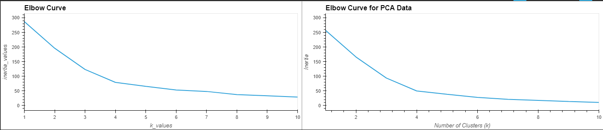
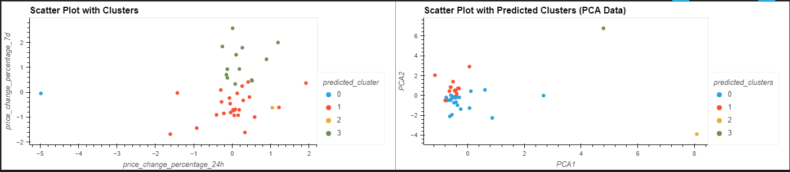

# Data-assignment-week19-cryptoclustering-challenge

# Analysis

The crypto data was downloaded from the bootcampspot. Using an inclass activity as the basis of the code format in addition to the starter code provided, (University of Adelaide 2024), crypto data was transformed and visualised to aid in the analysis using unsupervised learning techniques.

After the data was prepared inline with the starter code instructions, the best value of k was determined using inertia values.

As depicted in the below graphs, the best value for k was 4 for both the original data set and the principical component analysis (PCA) data set.

When comparing the clusters output between the original and PCA data sets, the PCA scatter plot clearly demonstrates that using this data set results in a tighter, more concentrated scatter of results.

# Reference List

University of Adelaide. (2024). UADEL-VIRT-DATA-PT-12-2023-U-LOLC. GitHub. retrieved 12 May 2024 https://git.bootcampcontent.com/University-of-Adelaide/UADEL-VIRT-DATA-PT-12-2023-U-LOLC/-/blob/main/19-Unsupervised-Learning/3/Activities/04-Stu-Energise_Your_Stock_Clustering/Solved/energise_your_stock_clustering_solution.ipynb?ref_type=heads

OpenAI. (2024). ChatGPT [Computer software]. Retrieved 12 May 2024 (https://chat.openai.com/)